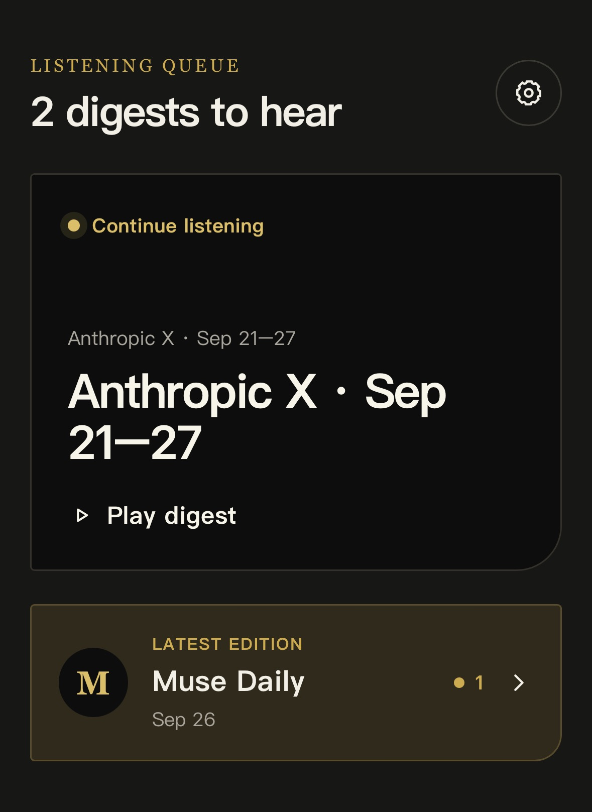
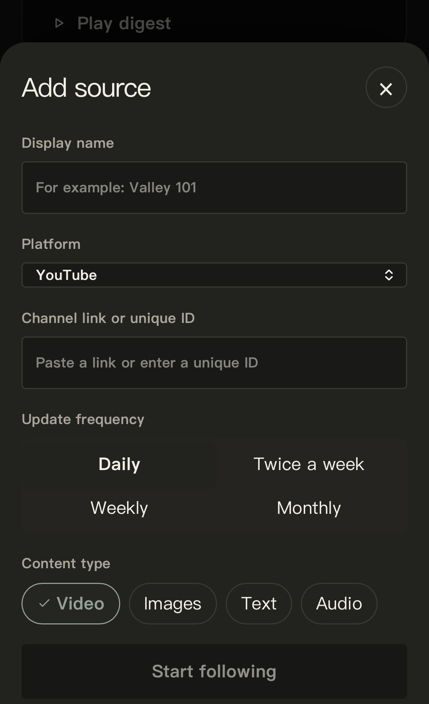
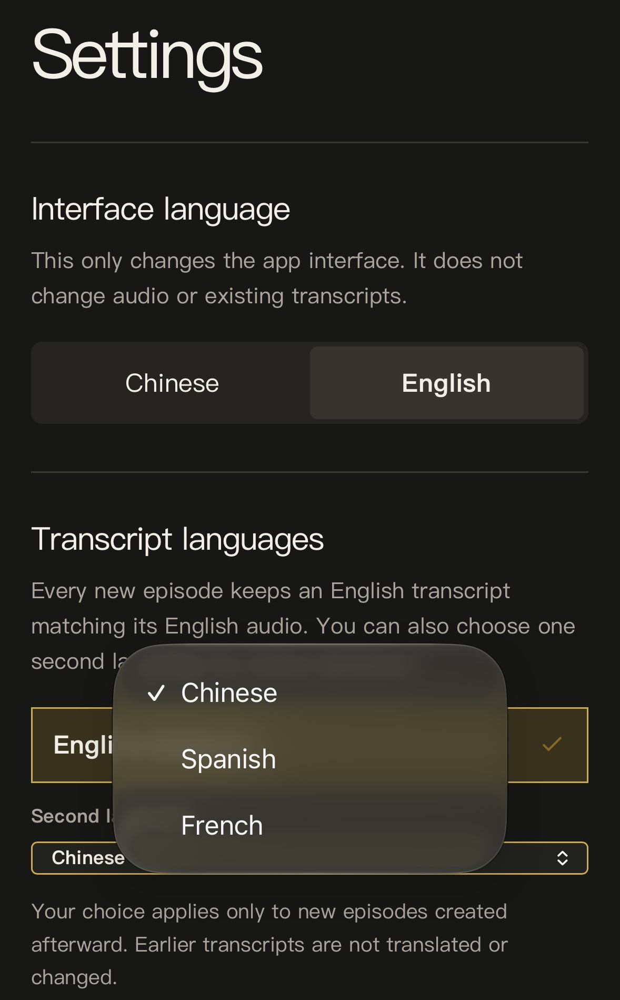
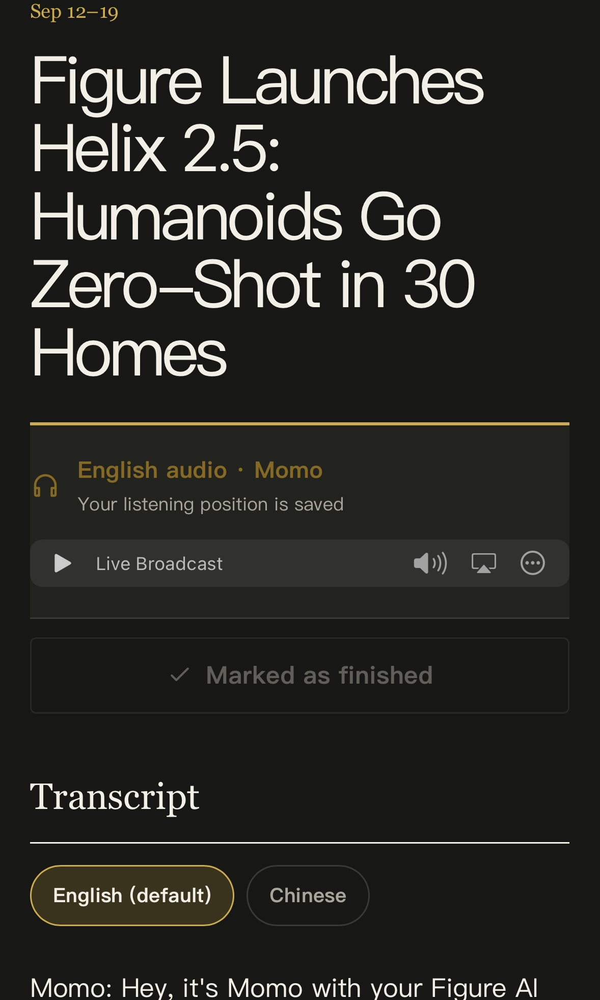
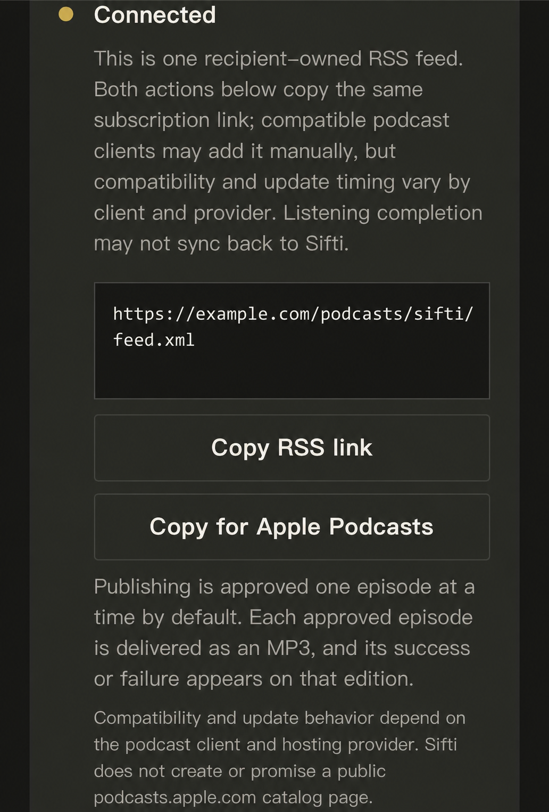

# Sifti

**Turn the content you follow into scheduled bilingual summaries, transcripts, and personalized audio editions.**

Sifti is a personal, audio-first content digest designed for the moments when your eyes are busy but your attention is available—commuting, driving, walking, or simply taking a break from long videos and feeds.

It brings together a recipient's own Muse Daily content and selected external sources, then organizes generated summaries, English audio, and bilingual transcripts into a calm listening queue.

> [!IMPORTANT]
> Sifti is currently a functional prototype built in Meta Muse. This repository contains a portable Muse build specification, not exported application source code. Automated content ingestion, summarization, translation, TTS, and podcast hosting depend on capabilities available in the recipient's Muse environment or on a separately configured pipeline.

## What Sifti Does

- Creates scheduled digest editions from Muse Daily and user-selected sources
- Produces concise, AI-generated summaries with links to original material
- Generates English narration and saves listening progress
- Provides an English transcript plus one optional secondary transcript
- Supports Simplified Chinese, Spanish, and French as secondary transcript languages
- Organizes unfinished editions in a mobile-first listening queue
- Supports optional recipient-owned podcast publishing when the environment provides that capability
- Keeps sources, schedules, generated content, links, and destinations isolated to each installation

## Current Language Support

| Feature | Supported languages |
|---|---|
| Interface | English, Simplified Chinese |
| Primary transcript and audio | English |
| Secondary transcript | Simplified Chinese, Spanish, French |

Spanish and French are transcript options only; the interface itself is currently available in English and Simplified Chinese.

## Repository Contents

```text
sifti-muse-template/
├── README.md
├── template/
│   └── Sifti_Muse_Build_Template_v0.4.3.md
├── docs/
│   ├── USAGE.md
│   └── LIMITATIONS.md
└── screenshots/
    ├── 01-listening-queue.jpeg
    ├── 02-add-source.jpeg
    ├── 03-language-settings.jpeg
    ├── 04-audio-transcript.jpeg
    └── 05-podcast-feed.png
```

## Build Sifti in Muse

1. Download [`Sifti_Muse_Build_Template_v0.4.3.md`](template/Sifti_Muse_Build_Template_v0.4.3.md).
2. Start a new build conversation in your own Muse environment.
3. Attach the Markdown file.
4. Tell Muse: **“Build a new Sifti application from this specification.”**
5. Review the proposed plan and approve only the services and publishing actions you want connected.
6. Confirm that the new installation starts with your Muse Daily content and zero external sources.

See [Usage](docs/USAGE.md) for the complete setup and validation checklist.

## Make Sifti Your Own

Sifti is designed as a starting point, not a locked product.

After building Sifti in your own Muse environment, you can continue shaping it by asking your Muse to change the interface, summary style, source workflows, schedules, languages, audio behavior, or other features to better fit your habits.

The narrator name shown in the screenshots—**Momo**—is the original creator's Muse agent and is included only as an example. Each installation should use the recipient's own Muse agent identity, including its name, selected voice, speaking style, and preferred form of address throughout the interface, audio editions, and transcripts.

Each personalized installation evolves independently inside its recipient's Muse environment. Custom changes are not automatically maintained, synchronized, or overwritten by this repository. Before making significant changes, ask Muse to explain the proposed implementation and confirm that existing sources, editions, and privacy settings will be preserved.

## Privacy by Design

The portable template contains no original user's:

- Source names or creator selections
- Channel or feed URLs
- Summaries, transcripts, or audio
- Listening history or schedules
- Podcast destination
- Account identifiers, credentials, cookies, tokens, or API keys

A new installation must use only the recipient's account, sources, schedules, generated content, storage, and explicitly connected destinations.

## Screenshots

| Listening Queue | Add a Source |
|---|---|
| The home screen keeps unfinished digests and the latest edition easy to reach. | Choose a platform, update frequency, and content types to follow. |
|  |  |

| Language Settings | Audio and Bilingual Transcripts |
|---|---|
| Set the interface language and choose a supported secondary transcript language for new editions. | Listen to an English audio edition, resume from a saved position, and switch transcript languages. |
|  |  |

> **About “Momo” in the screenshots:** Momo is an example Muse agent, not a fixed Sifti character. Your installation can use your own agent's identity and voice.

### Podcast Destination

When the recipient selects **Create my podcast feed**, Muse checks for native podcast provisioning inside the setup flow. If the capability is available, Muse creates a new recipient-owned feed and Sifti displays its copyable RSS URL. The URL can be added manually to compatible podcast apps that support **Add by URL**, including Apple Podcasts and Pocket Casts. New published episodes can then arrive through the podcast app's normal feed updates.

Some providers need one published item before returning a valid RSS feed. In that case, the setup notice explains that selecting **Create my podcast feed** also authorizes a short **Welcome to Sifti** initialization trailer. The trailer uses the recipient's current Muse agent identity and does not publish, modify, or mark any existing digest as finished.

Feed compatibility, privacy, and discoverability depend on the selected provider and podcast app. When link-only or unlisted mode is supported, the feed is not intentionally submitted to public directories—but anyone with the URL may still be able to access published episodes. Treat the URL as shareable, not secret. Publishing remains opt-in, with per-episode approval as the default.

Only after Muse's native capability check fails should Sifti show the unsupported state. It may then offer a supported, recipient-authorized podcast-host connection when one is available, or remain an in-app listening experience. A pasted RSS subscription URL alone is not a writable publishing destination.

If a new build does not display an RSS URL, see [Podcast Setup and Troubleshooting](docs/USAGE.md#the-build-has-no-rss-link) for the exact Muse instruction to run recipient-specific native feed provisioning safely.



### Keeping the Listening Queue Accurate

Finishing an edition inside Sifti can mark it as finished automatically. Podcast apps do not reliably send their playback-completion state back to Sifti, so after listening externally, return to Sifti and select **Mark as finished**. This removes the edition from the unfinished queue without requiring it to be played again inside Muse.

## Known Limitations

The template describes the interface, data model, workflows, permissions, and ingestion contract. It does not bundle a universal content-generation backend or podcast host. Feature availability varies by Muse environment and connected services.

See [Known Limitations](docs/LIMITATIONS.md) for details.

## Version

Current portable template: **v0.4.3**

Highlights in v0.4.3:

- Checks native podcast provisioning inside Muse's setup flow before showing an unsupported state
- Allows a disclosed, provider-required **Welcome to Sifti** trailer under the feed-creation approval
- Uses the recipient's own Muse agent identity for narration and never inherits Momo by default
- Keeps existing digests untouched during feed initialization
- Provides both generic RSS copying and Apple Podcasts-specific subscription guidance
- Preserves manual **Mark as finished** after listening in an external podcast app

## Responsible Use

Use public or properly authorized sources. Keep original links, label AI-generated summaries, and avoid redistributing substantial copyrighted material or cloned voices without permission.

## Project Status

Sifti is an evolving product prototype and portfolio project. Feedback, implementation experiments, and thoughtful discussions are welcome.

## Independence

Sifti is an independent prototype created by Luceternity. It is not affiliated with, endorsed by, or an official product of Meta or the Muse platform.
